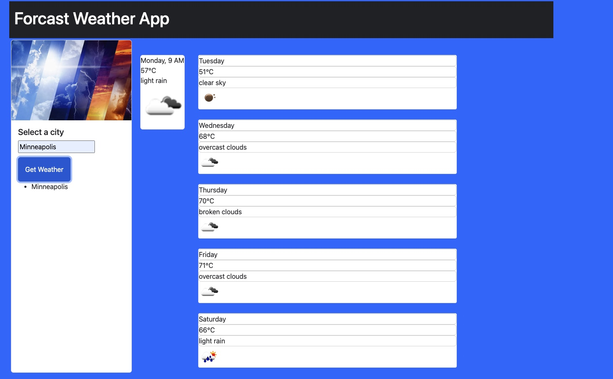
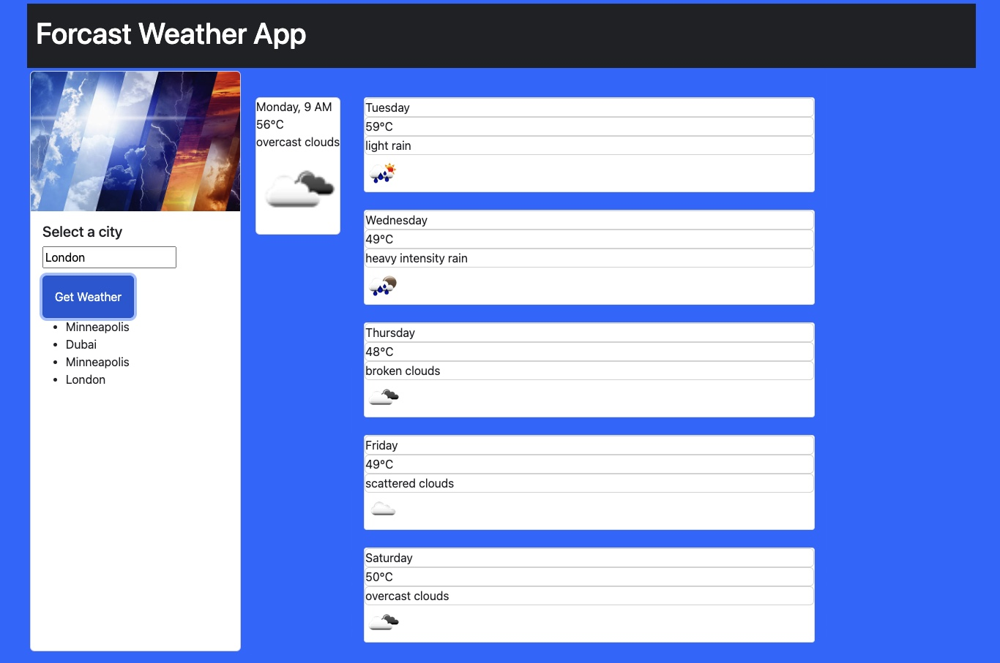

# WeatherForcastApp

# Server-Side APIs Challenge: Weather Dashboard
```

AS A Developer
I WANT to create a weather app for multiple cities
SO THAT users can plan a trip accordingly
```


```
its done
when the user have a weather dashboard with form inputs.
```
```
its done
when the user search for a city then the user can see the current and future weather for that city and that city is added to the search history.
```
```
its done
when the user view the weather of that city then they are presented with the city name, the date, an icon representation of weather conditions, the temperature, the humidity, and the the wind speed.
```
```

its done
when the user view future weather conditions for that city 
then they are presented with a 5-day forecast that displays the date, an icon representation of weather conditions, the temperature, the wind speed, and the humidity.
```
```

its done
when the user click on a city in the search history 
then the user again is presented with current and future conditions for that city.
```

#Images



